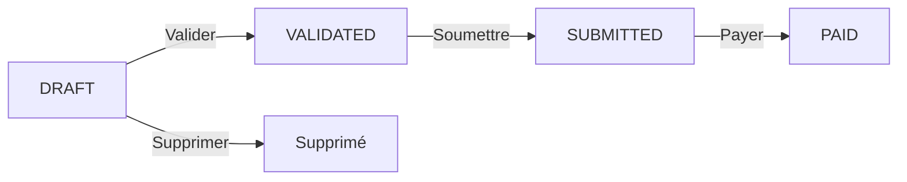

# 📊 GESTION COMPLÈTE DE LA TVA - PREDYKT Accounting API

## 📋 Table des matières

1. [Vue d'ensemble](#vue-densemble)
2. [Architecture du système](#architecture-du-système)
3. [Taxes camerounaises implémentées](#taxes-camerounaises-implémentées)
4. [Plan comptable OHADA pour la TVA](#plan-comptable-ohada-pour-la-tva)
5. [Fonctionnalités principales](#fonctionnalités-principales)
6. [API Endpoints](#api-endpoints)
7. [Déclaration de TVA (CA3)](#déclaration-de-tva-ca3)
8. [Gestion des fournisseurs et NIU](#gestion-des-fournisseurs-et-niu)
9. [Workflow complet](#workflow-complet)
10. [Exemples d'utilisation](#exemples-dutilisation)
11. [Règles fiscales camerounaises](#règles-fiscales-camerounaises)

---

## 📖 Vue d'ensemble

Ce système implémente une **gestion professionnelle et complète de la fiscalité camerounaise**, conforme au référentiel **OHADA** (Organisation pour l'Harmonisation en Afrique du Droit des Affaires) et aux **logiciels de comptabilité professionnels** (Sage, EBP, Ciel, etc.).

### ✨ Caractéristiques principales

- ✅ **Conformité OHADA** : Plan comptable SYSCOHADA révisé
- ✅ **5 taxes camerounaises** : TVA, Acompte IS, AIR (précompte), IRPP Loyer, CNPS
- ✅ **Déclaration automatique** : Génération CA3 mensuel à partir du grand livre
- ✅ **Alertes intelligentes** : Détection automatique des fournisseurs sans NIU
- ✅ **Gestion du crédit de TVA** : Report automatique du crédit de TVA
- ✅ **Multi-tenant** : Isolation complète par entreprise
- ✅ **Traçabilité** : Historique complet de tous les calculs fiscaux

---

## 🏗️ Architecture du système

### Composants principaux

```
┌─────────────────────────────────────────────────────────────────┐
│                    PREDYKT TAX MANAGEMENT                        │
└─────────────────────────────────────────────────────────────────┘
                              │
        ┌─────────────────────┼─────────────────────┐
        │                     │                     │
   ┌────▼────┐         ┌──────▼──────┐      ┌──────▼──────┐
   │  Taxes  │         │ Fournisseurs│      │ Déclarations│
   │  (TVA,  │         │   (NIU)     │      │   (CA3)     │
   │  IS, AIR│         │             │      │             │
   │  IRPP)  │         └─────────────┘      └─────────────┘
   └────┬────┘                 │                     │
        │                      │                     │
        └──────────────┬───────┴─────────────────────┘
                       │
              ┌────────▼────────┐
              │  Grand Livre    │
              │    (General     │
              │     Ledger)     │
              └─────────────────┘
```

### Entités clés

| Entité | Description | Table |
|--------|-------------|-------|
| `TaxConfiguration` | Configuration des taxes par entreprise | `tax_configurations` |
| `TaxCalculation` | Historique des calculs fiscaux | `tax_calculations` |
| `Supplier` | Fournisseurs avec gestion du NIU | `suppliers` |
| `VATDeclaration` | Déclarations de TVA CA3/CA12 | `vat_declarations` |
| `GeneralLedger` | Écritures comptables | `general_ledger` |

---

## 💰 Taxes camerounaises implémentées

### 1. TVA - Taxe sur la Valeur Ajoutée (19,25%)

**Compte OHADA :**
- **4431** : TVA collectée sur ventes de marchandises
- **4432** : TVA collectée sur prestations de services
- **4433** : TVA collectée sur travaux
- **4441** : TVA due ou crédit de TVA (solde)
- **4451** : TVA récupérable sur immobilisations
- **4452** : TVA récupérable sur achats
- **4453** : TVA récupérable sur transport
- **4454** : TVA récupérable sur services extérieurs

**Règles :**
- Taux normal : **19,25%**
- Déclaration : **Mensuelle (CA3)** - avant le 15 du mois suivant
- Application : Ventes de biens et services (sauf exonérations)
- Récupération : TVA déductible sur achats professionnels

**Cas particuliers de TVA non récupérable :**
- ❌ Véhicules de tourisme (< 9 places)
- ❌ Carburant pour véhicules de tourisme
- ❌ Frais de représentation non justifiés
- ❌ Dépenses somptuaires et de luxe
- ⚠️ Carburant véhicules utilitaires : **80% récupérable**

### 2. Acompte IS (IMF) - Impôt Minimum Forfaitaire (2,2%)

**Compte OHADA :** `4411` - Acompte IS

**Règles :**
- Taux : **2,2% du chiffre d'affaires mensuel**
- Déclaration : **Mensuelle** - avant le 15 du mois suivant
- Application : Sur le chiffre d'affaires TTC des ventes
- Imputation : Déductible de l'IS annuel

### 3. AIR - Acompte sur Impôt sur le Revenu (Précompte)

**Compte OHADA :** `4478` - Autres impôts et contributions

**Règles :**
- Taux **avec NIU** : **2,2%** des achats
- Taux **sans NIU** : **5,5%** des achats (pénalité de 3,3%)
- Déclaration : **Mensuelle** - avant le 15 du mois suivant
- Application : Retenue à la source sur paiements fournisseurs

**💡 Importance critique du NIU :**
```
Achat de 1 000 000 XAF
├─ Avec NIU    : AIR = 22 000 XAF (2,2%)
└─ Sans NIU    : AIR = 55 000 XAF (5,5%) → Pénalité de 33 000 XAF !
```

### 4. IRPP Loyer - Impôt sur les Loyers (15%)

**Compte OHADA :** `4471` - Impôt Général sur le revenu

**Règles :**
- Taux : **15% du loyer**
- Déclaration : **Mensuelle** - avant le 15 du mois suivant
- Application : Retenue à la source sur paiement des loyers
- Paiement : 85% au bailleur, 15% reversé à l'État

**Exemple :**
```
Loyer mensuel : 500 000 XAF
├─ Au bailleur : 425 000 XAF (85%)
└─ À l'État    :  75 000 XAF (15% IRPP Loyer)
```

### 5. CNPS - Cotisations sociales (~20%)

**Compte OHADA :** `431` - Sécurité sociale

**Règles :**
- Taux indicatif : **~20% des salaires bruts**
- Déclaration : Variable selon calendrier CNPS
- Application : Sur masse salariale
- Composition : Part patronale + part salariale

---

## 📚 Plan comptable OHADA pour la TVA

### Classe 44 - État et collectivités publiques

#### 443 - TVA Collectée (CRÉDIT)

| Compte | Libellé | Usage |
|--------|---------|-------|
| **4431** | TVA facturée sur ventes | Ventes de marchandises |
| **4432** | TVA facturée sur services | Prestations de services |
| **4433** | TVA facturée sur travaux | Travaux réalisés |
| **4434** | TVA sur production livrée à soi-même | Immobilisations produites |

#### 444 - TVA Due / Crédit

| Compte | Libellé | Usage |
|--------|---------|-------|
| **4441** | TVA due ou crédit de TVA | **Solde net de TVA** |

#### 445 - TVA Déductible (DÉBIT)

| Compte | Libellé | Usage |
|--------|---------|-------|
| **4451** | TVA récupérable sur immobilisations | Acquisitions d'immobilisations |
| **4452** | TVA récupérable sur achats | Achats de marchandises et matières |
| **4453** | TVA récupérable sur transport | Frais de transport |
| **4454** | TVA récupérable sur services | Prestations de services |
| **4455** | TVA récupérable sur factures non parvenues | Achats comptabilisés non facturés |
| **4456** | TVA transférée par d'autres entreprises | Groupes fiscaux |

### Écriture comptable type

**Exemple : Vente de marchandises 1 000 000 XAF HT**

```
Date : 15/11/2024
Journal : VE (Ventes)

Débit  : 411 - Clients                1 192 500 XAF
Crédit : 701 - Ventes de marchandises 1 000 000 XAF
Crédit : 4431 - TVA collectée            192 500 XAF (19,25%)
```

**Exemple : Achat de fournitures 500 000 XAF HT**

```
Date : 20/11/2024
Journal : AC (Achats)

Débit  : 604 - Achats de fournitures   500 000 XAF
Débit  : 4452 - TVA récupérable         96 250 XAF (19,25%)
Crédit : 401 - Fournisseurs            596 250 XAF
```

---

## ⚙️ Fonctionnalités principales

### 1. Configuration automatique des taxes

Au moment de la création d'une entreprise, toutes les configurations fiscales sont initialisées automatiquement avec les taux légaux par défaut.

**Fichier :** `TaxService.java:42` - `initializeDefaultTaxConfigurations()`

```java
// Initialisation automatique lors de la création d'une entreprise
for (TaxType taxType : TaxType.values()) {
    TaxConfiguration config = TaxConfiguration.createDefault(company, taxType);
    taxConfigRepository.save(config);
}
```

### 2. Calcul automatique des taxes

Lors de chaque transaction (import CSV, saisie manuelle), les taxes applicables sont calculées automatiquement selon le type de transaction (vente/achat) et le fournisseur.

**Fichier :** `TaxService.java:66` - `calculateAllTaxesForTransaction()`

```java
// Exemple d'appel
List<TaxCalculation> taxes = taxService.calculateAllTaxesForTransaction(
    company,
    amount,           // 1 000 000 XAF
    "SALE",           // Type de transaction
    null,             // Pas de fournisseur pour une vente
    "701",            // Compte de vente
    LocalDate.now()
);

// Résultat : TVA 192 500 XAF + Acompte IS 22 000 XAF
```

### 3. Gestion intelligente du NIU

Le système détecte automatiquement les fournisseurs sans NIU et applique le taux AIR majoré (5,5% au lieu de 2,2%), tout en générant une alerte.

**Fichier :** `TaxService.java:160` - `calculateAIR()`

```java
boolean hasNiu = supplier.hasValidNiu();
TaxType airType = TaxType.getAIRType(hasNiu);  // AIR_WITH_NIU ou AIR_WITHOUT_NIU
BigDecimal taxRate = supplier.getApplicableAirRate();  // 2.2% ou 5.5%

if (!hasNiu) {
    calculation.addAlert(
        "⚠️ ALERTE: Fournisseur sans NIU - Taux majoré à 5,5% (surcoût: XXX XAF)"
    );
}
```

### 4. Déclaration de TVA CA3 (Mensuelle)

Génération automatique de la déclaration de TVA mensuelle à partir des écritures du grand livre.

**Fichier :** `VATDeclarationService.java:41` - `generateMonthlyDeclaration()`

**Processus :**
1. Extraction des soldes de comptes TVA du grand livre (4431, 4432, 4433, 4451, 4452, 4453, 4454)
2. Calcul du total TVA collectée et TVA déductible
3. Récupération du crédit de TVA du mois précédent
4. Calcul du solde : `TVA à payer = TVA collectée - TVA déductible - Crédit précédent`
5. Si négatif : crédit de TVA à reporter sur le mois suivant

### 5. Alertes fiscales

Le système génère automatiquement des alertes pour :
- ❌ Fournisseurs sans NIU (pénalité AIR 5,5%)
- ❌ Anomalies de calcul
- ❌ Déclarations en retard
- ⚠️ TVA non récupérable

**Fichier :** `TaxCalculationRepository.java:46` - `findCalculationsWithAlerts()`

### 6. Dashboard fiscal

Vue d'ensemble de la situation fiscale de l'entreprise avec :
- Total des taxes du mois en cours
- Nombre d'alertes actives
- Nombre de fournisseurs sans NIU
- Statut de conformité fiscale
- Répartition des taxes par type

**Fichier :** `TaxController.java:187` - `/dashboard`

---

## 🌐 API Endpoints

### Base URL
```
http://localhost:8080/api/v1/companies/{companyId}/taxes
```

### 1. Résumé fiscal mensuel

```http
GET /companies/{companyId}/taxes/summary?year=2024&month=11
```

**Réponse :**
```json
{
  "success": true,
  "data": {
    "startDate": "2024-11-01",
    "endDate": "2024-11-30",
    "fiscalPeriod": "2024-11",
    "vatAmount": 1250000.00,
    "isAdvanceAmount": 150000.00,
    "airAmount": 85000.00,
    "irppRentAmount": 75000.00,
    "cnpsAmount": 200000.00,
    "totalTaxes": 1760000.00,
    "airPenaltyCost": 15000.00,
    "alertCount": 3,
    "taxBreakdown": {
      "TVA": 1250000.00,
      "Acompte IS (IMF)": 150000.00,
      "AIR (Précompte)": 85000.00,
      "IRPP Loyer": 75000.00,
      "CNPS": 200000.00
    }
  }
}
```

### 2. Dashboard fiscal

```http
GET /companies/{companyId}/taxes/dashboard
```

**Réponse :**
```json
{
  "success": true,
  "data": {
    "currentPeriod": "2024-11",
    "totalTaxes": 1760000.00,
    "alertCount": 3,
    "suppliersWithoutNiu": 5,
    "activeTaxConfigurations": 5,
    "complianceStatus": "NEEDS_ATTENTION",
    "taxBreakdown": { ... }
  }
}
```

### 3. Alertes fiscales

```http
GET /companies/{companyId}/taxes/alerts
```

**Réponse :**
```json
{
  "success": true,
  "data": [
    {
      "id": 123,
      "taxType": "AIR_WITHOUT_NIU",
      "calculationDate": "2024-11-15",
      "supplierName": "SARL TechPro",
      "niuNumber": null,
      "baseAmount": 500000.00,
      "taxAmount": 27500.00,
      "penaltyCost": 16500.00,
      "alertMessage": "⚠️ ALERTE: Fournisseur sans NIU - Taux majoré à 5,5%",
      "severity": "HIGH",
      "actionRequired": "Régulariser NIU fournisseur"
    }
  ]
}
```

### 4. Configurations fiscales

```http
GET /companies/{companyId}/taxes/configurations
```

**Réponse :**
```json
{
  "success": true,
  "data": [
    {
      "id": 1,
      "taxType": "VAT",
      "taxName": "TVA - Taxe sur la Valeur Ajoutée",
      "taxRate": 19.25,
      "accountNumber": "4431",
      "isActive": true,
      "isAutomatic": true,
      "applyToSales": true,
      "applyToPurchases": false,
      "legalReference": "CGI Art. 127 - TVA au taux normal",
      "dueDay": 15
    },
    // ... autres taxes
  ]
}
```

### 5. Modifier le taux d'une taxe

```http
PUT /companies/{companyId}/taxes/configurations/VAT/rate?newRate=19.25
```

### 6. Activer/Désactiver une taxe

```http
PUT /companies/{companyId}/taxes/configurations/VAT/toggle?active=true
```

---

## 📄 Déclaration de TVA (CA3)

### Génération automatique

```http
POST /companies/{companyId}/taxes/vat-declarations/generate?year=2024&month=11
```

**Processus automatique :**

1. **Extraction des données du grand livre** (comptes 443x et 445x)
2. **Calcul de la TVA collectée** :
   - Compte 4431 : Ventes de marchandises
   - Compte 4432 : Services
   - Compte 4433 : Travaux
3. **Calcul de la TVA déductible** :
   - Compte 4451 : Immobilisations
   - Compte 4452 : Achats
   - Compte 4453 : Transport
   - Compte 4454 : Services
4. **Récupération du crédit de TVA** du mois précédent
5. **Calcul du solde** : TVA à payer ou crédit de TVA

**Réponse :**
```json
{
  "success": true,
  "data": {
    "id": 45,
    "declarationType": "CA3_MONTHLY",
    "fiscalPeriod": "2024-11",
    "startDate": "2024-11-01",
    "endDate": "2024-11-30",
    "vatCollectedSales": 850000.00,
    "vatCollectedServices": 320000.00,
    "vatCollectedWorks": 80000.00,
    "totalVatCollected": 1250000.00,
    "vatDeductibleFixedAssets": 0.00,
    "vatDeductiblePurchases": 450000.00,
    "vatDeductibleTransport": 25000.00,
    "vatDeductibleServices": 75000.00,
    "totalVatDeductible": 550000.00,
    "previousVatCredit": 0.00,
    "vatToPay": 700000.00,
    "vatCreditToCarryForward": 0.00,
    "status": "DRAFT"
  }
}
```

### Workflow de déclaration



#### 1. Valider la déclaration

```http
PUT /companies/{companyId}/taxes/vat-declarations/45/validate
```

- Recalcule tous les totaux
- Change le statut : `DRAFT` → `VALIDATED`
- Verrouille les montants

#### 2. Soumettre la déclaration

```http
PUT /companies/{companyId}/taxes/vat-declarations/45/submit?referenceNumber=DGI-2024-11-12345
```

- Enregistre la date de soumission
- Change le statut : `VALIDATED` → `SUBMITTED`
- Enregistre le numéro de référence DGI

#### 3. Marquer comme payée

```http
PUT /companies/{companyId}/taxes/vat-declarations/45/mark-paid
```

- Enregistre la date de paiement
- Change le statut : `SUBMITTED` → `PAID`

### Rapport de déclaration

```http
GET /companies/{companyId}/taxes/vat-declarations/45/report
```

**Réponse (text/plain) :**

```
═══════════════════════════════════════════════════════
        DÉCLARATION DE TVA - CA3 MENSUEL
═══════════════════════════════════════════════════════

Entreprise: SARL EXAMPLE TRADING
Période fiscale: 2024-11
Du 2024-11-01 au 2024-11-30
Statut: VALIDATED

═══════════════════════════════════════════════════════
SECTION 1: TVA COLLECTÉE
═══════════════════════════════════════════════════════
TVA sur ventes (4431)       :     850 000,00 XAF
TVA sur services (4432)     :     320 000,00 XAF
TVA sur travaux (4433)      :      80 000,00 XAF
───────────────────────────────────────────────────────
TOTAL TVA COLLECTÉE         :   1 250 000,00 XAF

═══════════════════════════════════════════════════════
SECTION 2: TVA DÉDUCTIBLE
═══════════════════════════════════════════════════════
TVA immobilisations (4451)  :           0,00 XAF
TVA achats (4452)           :     450 000,00 XAF
TVA transport (4453)        :      25 000,00 XAF
TVA services (4454)         :      75 000,00 XAF
───────────────────────────────────────────────────────
TOTAL TVA DÉDUCTIBLE        :     550 000,00 XAF

═══════════════════════════════════════════════════════
SECTION 3: SOLDE DE TVA
═══════════════════════════════════════════════════════
Crédit mois précédent       :           0,00 XAF
TVA nette (collectée - déd) :     700 000,00 XAF
───────────────────────────────────────────────────────
TVA À PAYER                 :     700 000,00 XAF
═══════════════════════════════════════════════════════

Date d'édition: 2024-12-03
═══════════════════════════════════════════════════════
```

### Récupérer toutes les déclarations

```http
GET /companies/{companyId}/taxes/vat-declarations
```

### Récupérer par statut

```http
GET /companies/{companyId}/taxes/vat-declarations/status/DRAFT
```

### Supprimer une déclaration (DRAFT uniquement)

```http
DELETE /companies/{companyId}/taxes/vat-declarations/45
```

---

## 👥 Gestion des fournisseurs et NIU

### Importance du NIU

Le **NIU (Numéro d'Identifiant Unique)** est **CRUCIAL** pour le calcul de l'AIR (précompte). Un fournisseur **sans NIU** entraîne une **pénalité de 3,3%** sur chaque transaction.

**Impact financier :**

| Montant achat | Avec NIU (2,2%) | Sans NIU (5,5%) | **Pénalité** |
|---------------|-----------------|-----------------|--------------|
| 1 000 000 XAF | 22 000 XAF | 55 000 XAF | **33 000 XAF** |
| 10 000 000 XAF | 220 000 XAF | 550 000 XAF | **330 000 XAF** |
| 100 000 000 XAF | 2 200 000 XAF | 5 500 000 XAF | **3 300 000 XAF** |

### API Fournisseurs

**Base URL :**
```
http://localhost:8080/api/v1/companies/{companyId}/suppliers
```

#### 1. Créer un fournisseur

```http
POST /companies/{companyId}/suppliers
Content-Type: application/json

{
  "name": "SARL TechPro",
  "niuNumber": "M051234567890123",
  "taxId": "P051234567890",
  "email": "contact@techpro.cm",
  "phone": "+237 699 12 34 56",
  "address": "Rue de la Liberté, Douala",
  "city": "Douala",
  "country": "CM",
  "supplierType": "SERVICES",
  "paymentTerms": 30
}
```

#### 2. Liste des fournisseurs sans NIU

```http
GET /companies/{companyId}/suppliers/without-niu
```

**Réponse :**
```json
{
  "success": true,
  "data": [
    {
      "id": 12,
      "name": "SARL InfoTech",
      "niuNumber": null,
      "hasNiu": false,
      "applicableAirRate": 5.5,
      "requiresAlert": true,
      "alertMessage": "⚠️ NIU manquant - Taux AIR majoré à 5,5%"
    }
  ]
}
```

#### 3. Mettre à jour le NIU

```http
PUT /companies/{companyId}/suppliers/12/niu?niuNumber=M051234567890123
```

**Réponse :**
```json
{
  "success": true,
  "data": {
    "supplierId": 12,
    "supplierName": "SARL InfoTech",
    "niuNumber": "M051234567890123",
    "previousAirRate": "5.5%",
    "newAirRate": "2.2%",
    "message": "✅ NIU ajouté avec succès - Taux AIR réduit de 5,5% à 2,2% (économie de 3,3%)"
  }
}
```

#### 4. Statistiques fournisseurs

```http
GET /companies/{companyId}/suppliers/statistics
```

**Réponse :**
```json
{
  "success": true,
  "data": {
    "totalSuppliers": 25,
    "activeSuppliers": 23,
    "inactiveSuppliers": 2,
    "suppliersWithNiu": 18,
    "suppliersWithoutNiu": 5,
    "niuComplianceRate": 78.26,
    "rentSuppliers": 2,
    "complianceStatus": "GOOD"
  }
}
```

**Statut de conformité :**
- `EXCELLENT` : 100% des fournisseurs ont un NIU
- `GOOD` : ≥ 80% avec NIU
- `NEEDS_IMPROVEMENT` : 50-79% avec NIU
- `CRITICAL` : < 50% avec NIU

---

## 🔄 Workflow complet

### Scénario : Import de transactions et génération de déclaration TVA

#### Étape 1 : Import des activités (CSV)

```http
POST /companies/1/import/activities-csv
Content-Type: multipart/form-data
file: activités.csv
```

Le système :
1. Parse le CSV
2. Mappe automatiquement les activités aux comptes OHADA
3. **Calcule automatiquement les taxes** pour chaque transaction
4. Crée les écritures dans le grand livre
5. Crée les enregistrements de calculs fiscaux

#### Étape 2 : Vérification des alertes

```http
GET /companies/1/taxes/alerts
```

**Si alertes → Régulariser les fournisseurs sans NIU :**

```http
PUT /companies/1/suppliers/12/niu?niuNumber=M051234567890123
```

#### Étape 3 : Génération de la déclaration TVA

```http
POST /companies/1/taxes/vat-declarations/generate?year=2024&month=11
```

Le système :
1. Extrait les soldes des comptes TVA (443x, 445x)
2. Calcule TVA collectée et déductible
3. Récupère le crédit de TVA du mois précédent
4. Calcule le solde (TVA à payer ou crédit de TVA)
5. Crée la déclaration en statut `DRAFT`

#### Étape 4 : Validation de la déclaration

```http
GET /companies/1/taxes/vat-declarations/45/report
```

Vérifier le rapport, puis :

```http
PUT /companies/1/taxes/vat-declarations/45/validate
```

#### Étape 5 : Soumission à la DGI

```http
PUT /companies/1/taxes/vat-declarations/45/submit?referenceNumber=DGI-2024-11-12345
```

#### Étape 6 : Paiement

Une fois la TVA payée :

```http
PUT /companies/1/taxes/vat-declarations/45/mark-paid
```

---

## 💼 Exemples d'utilisation

### Exemple 1 : Calcul de TVA sur une vente

**Transaction :**
- Vente de marchandises : 5 000 000 XAF HT
- Date : 15/11/2024

**Calcul automatique :**

```java
List<TaxCalculation> taxes = taxService.calculateAllTaxesForTransaction(
    company,
    new BigDecimal("5000000"),  // Montant HT
    "SALE",
    null,
    "701",  // Ventes de marchandises
    LocalDate.of(2024, 11, 15)
);

// Résultats :
// 1. TVA collectée : 5 000 000 × 19,25% = 962 500 XAF (Compte 4431)
// 2. Acompte IS     : 5 000 000 × 2,2%  = 110 000 XAF (Compte 4411)
// TOTAL TAXES : 1 072 500 XAF
```

**Écriture comptable générée :**

```
Débit  : 411 - Clients                5 962 500 XAF
Crédit : 701 - Ventes de marchandises 5 000 000 XAF
Crédit : 4431 - TVA collectée           962 500 XAF
Crédit : 4411 - Acompte IS              110 000 XAF (séparé)
```

### Exemple 2 : Calcul AIR sur achat avec et sans NIU

**Transaction :**
- Achat de services : 2 000 000 XAF HT
- Fournisseur A : **AVEC** NIU
- Fournisseur B : **SANS** NIU

**Fournisseur A (AVEC NIU) :**

```java
Supplier supplierA = supplierRepository.findById(1);
// supplierA.hasNiu = true

List<TaxCalculation> taxes = taxService.calculateAllTaxesForTransaction(
    company,
    new BigDecimal("2000000"),
    "PURCHASE",
    supplierA,  // Avec NIU
    "604",
    LocalDate.now()
);

// Résultats :
// 1. TVA déductible : 2 000 000 × 19,25% = 385 000 XAF (Compte 4452)
// 2. AIR (avec NIU) : 2 000 000 × 2,2%   =  44 000 XAF (Compte 4478)
```

**Fournisseur B (SANS NIU) :**

```java
Supplier supplierB = supplierRepository.findById(2);
// supplierB.hasNiu = false

List<TaxCalculation> taxes = taxService.calculateAllTaxesForTransaction(
    company,
    new BigDecimal("2000000"),
    "PURCHASE",
    supplierB,  // Sans NIU
    "604",
    LocalDate.now()
);

// Résultats :
// 1. TVA déductible  : 2 000 000 × 19,25% = 385 000 XAF (Compte 4452)
// 2. AIR (sans NIU)  : 2 000 000 × 5,5%   = 110 000 XAF (Compte 4478)
// 3. ⚠️ ALERTE : Surcoût de 66 000 XAF dû au NIU manquant !
```

**Comparaison :**

| Critère | Avec NIU | Sans NIU | **Différence** |
|---------|----------|----------|----------------|
| AIR | 44 000 XAF | 110 000 XAF | **+66 000 XAF** |
| Alerte | Non | **Oui** | Pénalité 3,3% |
| Statut | Conforme | **Non conforme** | À régulariser |

### Exemple 3 : Génération déclaration TVA complète

**Contexte :**
- Entreprise : SARL EXAMPLE TRADING
- Période : Novembre 2024
- 150 transactions dans le mois

**1. Génération automatique :**

```bash
curl -X POST "http://localhost:8080/api/v1/companies/1/taxes/vat-declarations/generate?year=2024&month=11"
```

**2. Résultats :**

```json
{
  "id": 45,
  "fiscalPeriod": "2024-11",

  // TVA Collectée
  "vatCollectedSales": 8500000.00,      // 4431
  "vatCollectedServices": 3200000.00,   // 4432
  "vatCollectedWorks": 800000.00,       // 4433
  "totalVatCollected": 12500000.00,

  // TVA Déductible
  "vatDeductibleFixedAssets": 0.00,     // 4451
  "vatDeductiblePurchases": 4500000.00, // 4452
  "vatDeductibleTransport": 250000.00,  // 4453
  "vatDeductibleServices": 750000.00,   // 4454
  "totalVatDeductible": 5500000.00,

  // Solde
  "previousVatCredit": 0.00,
  "vatToPay": 7000000.00,  // 12 500 000 - 5 500 000
  "vatCreditToCarryForward": 0.00,

  "status": "DRAFT"
}
```

**3. Calcul détaillé :**

```
TVA COLLECTÉE :
├─ Ventes (4431)    :  8 500 000 XAF
├─ Services (4432)  :  3 200 000 XAF
└─ Travaux (4433)   :    800 000 XAF
                      ──────────────
TOTAL COLLECTÉE     : 12 500 000 XAF

TVA DÉDUCTIBLE :
├─ Immobilisations  :          0 XAF
├─ Achats (4452)    :  4 500 000 XAF
├─ Transport (4453) :    250 000 XAF
└─ Services (4454)  :    750 000 XAF
                      ──────────────
TOTAL DÉDUCTIBLE    :  5 500 000 XAF

SOLDE :
TVA nette           :  7 000 000 XAF
Crédit précédent    :          0 XAF
                      ──────────────
TVA À PAYER         :  7 000 000 XAF
```

**4. Workflow complet :**

```bash
# Valider la déclaration
curl -X PUT "http://localhost:8080/api/v1/companies/1/taxes/vat-declarations/45/validate"

# Télécharger le rapport
curl "http://localhost:8080/api/v1/companies/1/taxes/vat-declarations/45/report" > CA3_2024-11.txt

# Soumettre à la DGI
curl -X PUT "http://localhost:8080/api/v1/companies/1/taxes/vat-declarations/45/submit?referenceNumber=DGI-2024-11-12345"

# Marquer comme payée
curl -X PUT "http://localhost:8080/api/v1/companies/1/taxes/vat-declarations/45/mark-paid"
```

---

## 📜 Règles fiscales camerounaises

### Échéances de paiement

| Taxe | Fréquence | Échéance | Compte |
|------|-----------|----------|--------|
| **TVA** | Mensuelle | 15 du mois suivant | 4441 |
| **Acompte IS (IMF)** | Mensuelle | 15 du mois suivant | 4411 |
| **AIR (Précompte)** | Mensuelle | 15 du mois suivant | 4478 |
| **IRPP Loyer** | Mensuelle | 15 du mois suivant | 4471 |
| **CNPS** | Variable | Selon calendrier CNPS | 431 |

### Pénalités et sanctions

| Infraction | Pénalité |
|------------|----------|
| Déclaration hors délai | 10% du montant + intérêts |
| Paiement tardif | 1,5% par mois de retard |
| Fournisseur sans NIU | **Taux AIR majoré : 5,5% au lieu de 2,2%** |
| Non-déclaration | Taxation d'office + pénalités |

### Cas d'exonération de TVA

- Exportations de biens et services
- Opérations bancaires et financières
- Enseignement et formation
- Santé (certaines prestations)
- Produits de première nécessité (liste officielle)

### TVA non récupérable (Exclusions)

| Type de dépense | Récupération TVA |
|-----------------|------------------|
| Véhicules de tourisme (< 9 places) | ❌ 0% |
| Carburant VP | ❌ 0% |
| Carburant VU (véhicules utilitaires) | ⚠️ 80% |
| Frais de représentation | ❌ 0% (sauf justification) |
| Dépenses de luxe | ❌ 0% |
| Achats professionnels normaux | ✅ 100% |

---

## 🎯 Résumé des fichiers clés

### Entités (Domain)

| Fichier | Description |
|---------|-------------|
| `TaxCalculation.java` | Historique des calculs fiscaux |
| `TaxConfiguration.java` | Configuration des taxes par entreprise |
| `Supplier.java` | Fournisseurs avec gestion du NIU |
| `VATDeclaration.java` | Déclarations de TVA CA3/CA12 |

### Enums

| Fichier | Description |
|---------|-------------|
| `TaxType.java` | Types de taxes (VAT, IS_ADVANCE, AIR, IRPP_RENT, CNPS) |
| `VATAccountType.java` | Comptes OHADA TVA (4431, 4441, 4451, etc.) |
| `VATRecoverableCategory.java` | Catégories de TVA récupérable/non récupérable |
| `VATDeclarationType.java` | Types de déclarations (CA3_MONTHLY, CA12_ANNUAL) |

### Services

| Fichier | Description |
|---------|-------------|
| `TaxService.java` | Service principal de gestion fiscale |
| `VATDeclarationService.java` | Service de déclaration de TVA |
| `SupplierService.java` | Service de gestion des fournisseurs |

### Controllers

| Fichier | Description |
|---------|-------------|
| `TaxController.java` | API REST pour la gestion fiscale et déclarations |
| `SupplierController.java` | API REST pour les fournisseurs |

### Repositories

| Fichier | Description |
|---------|-------------|
| `TaxCalculationRepository.java` | DAO pour les calculs fiscaux |
| `TaxConfigurationRepository.java` | DAO pour les configurations fiscales |
| `VATDeclarationRepository.java` | DAO pour les déclarations de TVA |
| `SupplierRepository.java` | DAO pour les fournisseurs |

### Migrations (Flyway)

| Fichier | Description |
|---------|-------------|
| `V9__add_tax_management_tables.sql` | Création des tables fiscales |

---

## ✅ Conformité logiciels de comptabilité

Ce système implémente les mêmes fonctionnalités que les logiciels professionnels :

### Comparaison avec Sage, EBP, Ciel

| Fonctionnalité | Sage/EBP/Ciel | PREDYKT | Statut |
|----------------|---------------|---------|--------|
| Plan comptable OHADA | ✅ | ✅ | **Conforme** |
| Calcul automatique TVA | ✅ | ✅ | **Conforme** |
| Déclaration CA3 | ✅ | ✅ | **Conforme** |
| Gestion crédit de TVA | ✅ | ✅ | **Conforme** |
| TVA non récupérable | ✅ | ✅ | **Conforme** |
| Alertes fiscales | ⚠️ | ✅ | **Supérieur** |
| Gestion NIU (AIR) | ⚠️ | ✅ | **Supérieur** |
| API REST | ❌ | ✅ | **Supérieur** |
| Multi-tenant | ❌ | ✅ | **Supérieur** |

---

## 📞 Support et documentation

Pour toute question sur le système de gestion fiscale :

- **Documentation technique** : `/api/v1/swagger-ui.html`
- **Code source** : `src/main/java/com/predykt/accounting/`
- **Migrations SQL** : `src/main/resources/db/migration/`

---

## 📝 Licence

Copyright © 2024 PREDYKT - Tous droits réservés

---

**🎉 Système de gestion fiscale professionnel pour l'Afrique francophone (OHADA) !**
